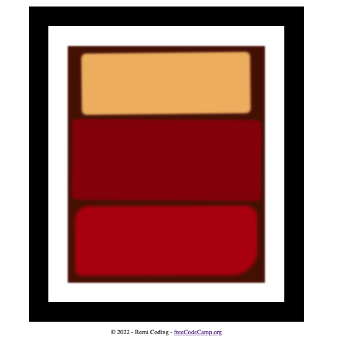

# Rothko Painting Page

This repository contains the HTML and CSS for the **Learn the CSS Box Model by Building a Rothko Painting** course by [freeCodeCamp](https://www.freecodecamp.org/learn/2022/responsive-web-design/).

The `index.html` file contains mostly HTML `
` tags for empty Box Model purpose.

The `css/styles.css` file is use in accord with the property of the Box Model to create Rothko-style rectangular art pieces with colors.

The page can be viewed here: [Rothko Painting](https://remicoding.github.io/rothko-painting-page/)

For your convenience, here is a screenshot of the page:

